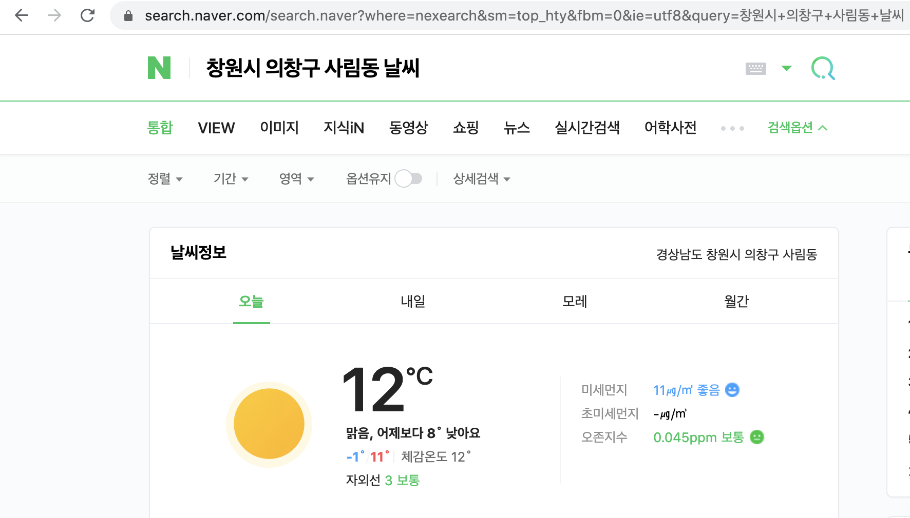
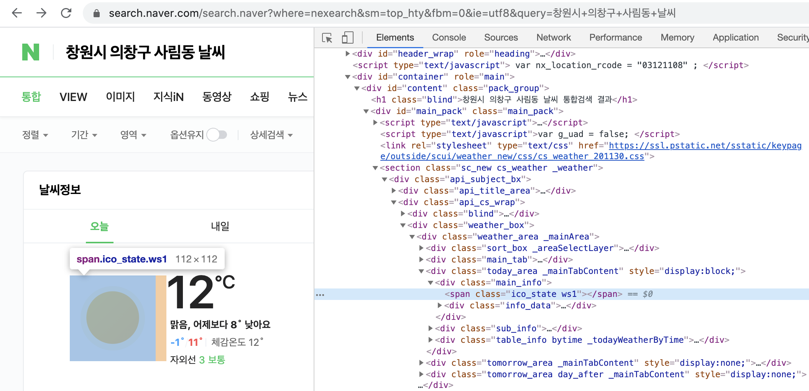
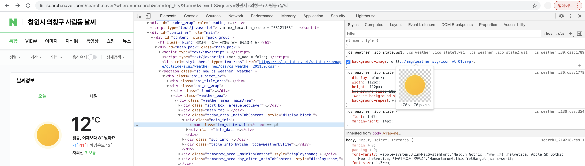
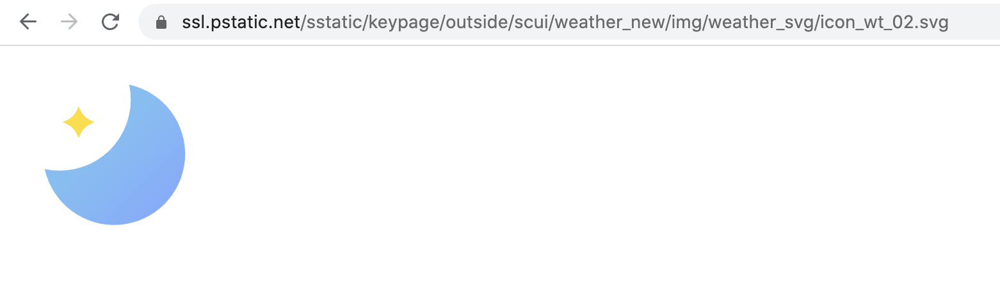
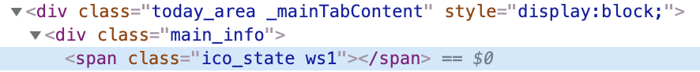
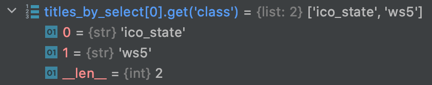
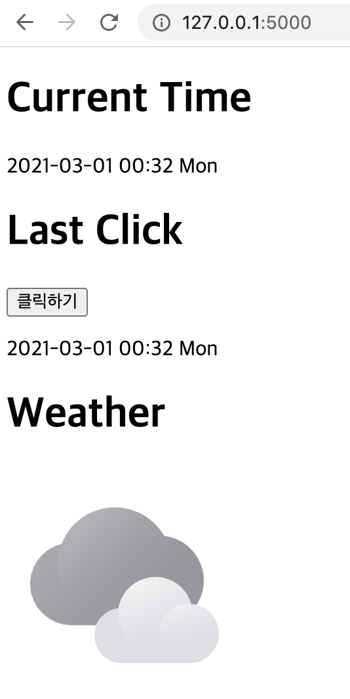

# IVIS 2021 동계 아두이노 세미나

주제 : 아두이노를 사용하여 연구실 내 전등스위치를 제어할 수 있는 웹애플리케이션 만들기

###### _세미나에 대한 이야기는_ _[ivis.kr/2021_동계_아두이노_세미나](http://ivis.kr/index.php/2021_%EB%8F%99%EA%B3%84_%EC%95%84%EB%91%90%EC%9D%B4%EB%85%B8_%EC%84%B8%EB%AF%B8%EB%82%98)_

---

### 참여자

- 김은지 : 아두이노 회로 - 서보모터, Cds 사용 이해
- 권찬진 : 라즈베리파이, 아두이노 블루투스 통신
- **지유진** : Flask - Python 웹서버
- 이세은 : HTML - 제어 및 센서인터페이스
- 이수균 : 프로젝트 도움
- 윤소정 : 프로젝트 총괄

---

### Flask 를 사용해 나타내고자 하는 기능

-  현재 '창원시 의창구 사림동' 날씨를 이미지로 표시
-  현재 (서버)시간 나타내기
-  페이지에 있는 버튼을 마지막으로 클릭한 시간

---

### 1. 이미지 웹 크롤링

- #### 웹 크롤링이란? 

    **웹 크롤러**(web crawler)는 조직적, 자동화된 방법으로 월드 와이드 웹을 탐색하는 컴퓨터 프로그램이다.
    
    웹 크롤러가 하는 작업을 '웹 크롤링'(web crawling) 혹은 '스파이더링'(spidering)이라 부른다. 검색 엔진과 같은 여러 사이트에서는 데이터의 최신 상태 유지를 위해 웹 크롤링한다. 웹 크롤러는 대체로 방문한 사이트의 모든 페이지의 복사본을 생성하는 데 사용되며, 검색 엔진은 이렇게 생성된 페이지를 보다 빠른 검색을 위해 인덱싱한다.
    
- #### 네이버 날씨에 나타나는 이미지 ~~훔쳐~~ 가져오기 

    웹 크롤링을 하기 전에 필요한 모듈을 import 해준다
    ```
    import bs4
    import Request
    ```

    
    
    url 을 살펴보면 'query=' 뒤에 검색한 위치가 나오는 것을 알 수 있다.
    
    ```
    enc_location = urllib.parse.quote('창원시 의창구 사림동 날씨')
    url = 'https://search.naver.com/search.naver?sm=top_hty&fbm=1&ie=utf8&query=' + enc_location

    html = urlopen(Request(url)).read()
    # 웹페이지 요청을 하는 코드이다. 특정 url을 적으면 웹페이지에 대한 소스코드들을 볼 수 있다.
    ```
  
    이제 해당 웹페이지의 HTML 코드를 볼 수 있다. 이것을 파이썬으로 이용하려면 Parsing 작업이 필요하다.
    ```
    soup = bs4.BeautifulSoup(html, "html.parser")
    # 파싱 작업을 거쳐야 각 요소에 접근하기 쉬워진다.
    ```
  
    내가 필요로 하는 부분은 날씨에 따라 달라지는 이미지다.
    
    
    
    개발자 모드 _(우클릭 > 검사)_ 로 들어가 내가 필요로 하는 부분의 코드를 살펴본다.
    
    내가 인터넷을 통해 찾아본 크롤링은, 해당 속성만 가리키면 정보를 나타내는 건데, 문제점은 이미지라는 것이다.
    
    이미지는 CSS 의 background-image 로 나타내고 있다.
    
     
    
    나는 여기서 CSS 에 속해있는 background-image 를 어떻게 ~~훔쳐~~가져 올까 고민했다.
    
    이미지를 나타내고있는 class 이름은 **ico_state_ws1** 이다.
    
    자세히 보니 background-image 가 url 로 업로드 되어있다. url 을 자세히 살펴보았다.
    
    `https://ssl.pstatic.net/sstatic/keypage/outside/scui/weather_new/img/weather_svg/icon_wt_01.svg`
    
    **class 이름에 존재하는 숫자랑 image url 에 존재하는 숫자가 같은것을 확인할 수 있었다.**
    
    #### 숫자를 바꾼다면?
    
    다른 날씨에 속하는 이미지들이 보여진다. 
    
    ###### 숫자 2에 해당하는 이미지
    
    
    
    #### 정리해보자.
    
    
    
    **div class="today_area" > div class="main_info" > span 태그에 해당하는 background-image 의 url 을 가져오면 된다.**
    
    span class="ico_state ws1" 에 들어있는 숫자를 가져와 변수에 저장해 주고, image url 주소에 변수를 합쳐 이미지를 불러온다!
    
- #### "ico_state ws1" 에서 "ws1" 꺼내오기
    
    ```
    titles_by_select = soup.select('div.today_area > div.main_info > span')
  
    klass_name = titles_by_select[0].get('class')[1]
    ``` 
    
    
    
    ```title_by_select[0].get('class')[1]``` 을 해주면 'ws5' 를 뽑아오는것을 알 수 있다.
    
- #### "ws1" 에서 숫자만 꺼내오기
    
    정규 표현식을 이용해 숫자를 꺼내보고자 한다.
    
    파이썬은 정규 표현식을 지원하기 위해 re(regular expression의 약어) 모듈을 제공한다. re 모듈은 파이썬을 설치할 때 자동으로 설치되는 기본 라이브러리로 사용 방법은 다음과 같다.
    
    ```
    import re
    p = re.complie('')      # ''안에는 컴파일 할 문자를 넣는다.
    ```
  
    ```
    p = re.compile('ws([0-9]*)')
    m = p.search(klass_name)        # search() 는 문자열 전체를 검색하여 정규식과 매치되는지 조사한다.
    svg = m.group(1).zfill(2)       # group() 은 매치된 문자열을 돌려주고, zfill() 은 0으로 채운다는 뜻이다.
    ```
    
    ###### 0으로 채워야 하는 이유는 이미지 링크에 들어가는 숫자가 '01' 과 같이 들어가기 때문이다.
    
    ```
    return 'https://ssl.pstatic.net/sstatic/keypage/outside/scui/weather_new/img/weather_svg/icon_wt_' + svg + '.svg'
    ```
    
    이제 숫자를 포함한 이미지 링크를 반환하는것까지 성공했다.
    
    _[정규 표현식에 대한 자세한 내용](https://wikidocs.net/4308)_
    
### 2. 현재 (서버)시간 나타내기

- #### datetime

    파이썬으로 시간을 나타내기 위해서 datetime 모듈을 사용한다.
    
    ```
    from datetime import datetime
    ```
    
- #### strftime

    시간을 문자열로 나타내기 위해서 strftime() 함수를 사용할 수 있다.  
    
    ```
    from datetime import datetime
    
    now = datetime.now()
  
    print(now.strftime('%Y-%m-%d %H:%M %a'))        # 년-월-일 시:분 요일
    ```    
    
### 3. 버튼 클릭한 마지막 시간 나타내기

- #### 기본 셋팅

    서버를 실행시켰을 때 처음으로 나오는 시간은 서버가 시작된 시간을 나타내게 했다. _서버가 시작되었을 때 현재 시간이랑 지난 버튼 클릭 시간이 같이 나타난다는 뜻이다._
    
    현재 시간을 나타내는 코드에서 변수만 바꿔, 함수 외부에서 똑같이 작성시켜 주었다.
    
    지난 버튼 클릭 시간을 나타내는 함수명은 ```def last_click():```, route 명은 ```/last_click``` 으로 설정했다.
    
    ```
    last_now = datetime.now()                               # 전역변수 
    last_time = last_now.strftime('%Y-%m-%d %H:%M %a')      # 전역변수 
    
    @app.route('/last_click', methods=['post'])     # 데이터는 post 방식으로 전달 
    def last_click():
        global last_now                     # 전역변수 last_now 를 사용하겠다고 설정 
        global last_time                    # 전역변수 last_time 을 사용하겠다고 설정 
        last_now = datetime.now()                               # last_now 는 전역변수
        last_time = last_now.strftime('%Y-%m-%d %H:%M %a')      # last_time 은 전역변수
        return redirect(url_for("home"))    # 함수명이 home 인 곳으로 redirect
    ``` 
    
    ###### 아래는 해당 html 코드를 나타낸다.
    ```
    <form method="post" action="/last_click">
        <button type="submit">클릭하기</button>
    </form>
    ```
  
    버튼을 클릭했을 때, action 이 /last_click 을 향하게 되어 있다. **즉, 버튼을 클릭 하면 새로고침 되면서 버튼을 클릭한 시간을 나타낸다.**
    
### 마무리

```
@app.route('/')
def home():
    now = datetime.now()
    current_time = now.strftime('%Y-%m-%d %H:%M %a')
    return render_template("home.html", current_time=current_time, weather=weather(), last_time=last_time)
                                        # 좌항은 html 에서의 변수명, 우항은 app.py 에서 정의되어있는 변수명 이다.
```

내가 나타내고자 하는 웹페이지는 하나의 페이지로 모든 정보를 다 담을 수 있었기에, home 이라는 함수에서 다 해결해주었다.

날씨 이미지 같은 경우, 함수를 return 해주는 형식으로 만들었기 때문에 호출만 해주면 되고, last_time 의 경우 전역변수이기 때문에 바로 전달해 줄 수 있었다.





### python 코드는 app.py 에서 살펴볼 수 있고, html 코드는 templates 폴더 > home.html 에서 살펴볼 수 있다.